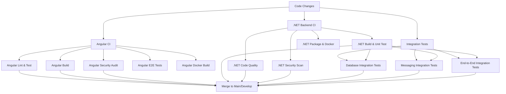

# Branch Protection and CI/CD Configuration

This document outlines the branch protection rules and CI/CD pipeline configuration for the ERP Inventory Module repository.

## Branch Protection Rules

### Main Branch Protection

The `main` branch should be protected with the following rules:

#### Required Status Checks

- ✅ **Angular CI / Lint, Test, and Build Angular App (18.x)**
- ✅ **Angular CI / Lint, Test, and Build Angular App (20.x)**
- ✅ **Angular CI / Security Audit**
- ✅ **.NET Backend CI / Build and Unit Test (Debug)**
- ✅ **.NET Backend CI / Build and Unit Test (Release)**
- ✅ **.NET Backend CI / Code Quality Analysis**
- ✅ **.NET Backend CI / Security Vulnerability Scan**
- ✅ **Integration Tests / Integration Tests (database-tests)**
- ✅ **Integration Tests / Integration Tests (messaging-tests)**
- ✅ **Integration Tests / Integration Tests (end-to-end-tests)**

#### Settings

- **Require branches to be up to date before merging**: ✅ Enabled
- **Require status checks to pass before merging**: ✅ Enabled
- **Require conversation resolution before merging**: ✅ Enabled
- **Require signed commits**: ✅ Enabled (recommended)
- **Require linear history**: ✅ Enabled (recommended)
- **Require deployments to succeed before merging**: ❌ Disabled (no deployments from main)

#### Access Restrictions

- **Restrict pushes that create files**: ❌ Disabled
- **Restrict who can push to matching branches**: ✅ Enabled
  - Repository administrators only
- **Allow force pushes**: ❌ Disabled
- **Allow deletions**: ❌ Disabled

### Develop Branch Protection

The `develop` branch should be protected with the following rules:

#### Required Status Checks

- ✅ **Angular CI / Lint, Test, and Build Angular App (20.x)** (single version for faster feedback)
- ✅ **.NET Backend CI / Build and Unit Test (Release)**
- ✅ **.NET Backend CI / Code Quality Analysis**

#### Settings

- **Require branches to be up to date before merging**: ✅ Enabled
- **Require status checks to pass before merging**: ✅ Enabled
- **Require conversation resolution before merging**: ✅ Enabled
- **Require signed commits**: ❌ Disabled (optional for development)
- **Require linear history**: ❌ Disabled (allow merge commits for feature branches)

#### Access Restrictions

- **Restrict who can push to matching branches**: ✅ Enabled
  - Repository administrators and maintainers
- **Allow force pushes**: ❌ Disabled
- **Allow deletions**: ❌ Disabled

## Workflow Triggers Configuration

### Angular CI Workflow (`angular.yml`)

```yaml
on:
  push:
    branches: [main, develop]
    paths:
      - "erp-inventory-angular/**"
      - ".github/workflows/angular.yml"
  pull_request:
    branches: [main, develop]
    paths:
      - "erp-inventory-angular/**"
      - ".github/workflows/angular.yml"
```

**Rationale**:

- Triggers on pushes to main/develop for deployment readiness
- Triggers on PRs for quality gates
- Path-based filtering prevents unnecessary runs

### .NET Backend CI Workflow (`dotnet.yml`)

```yaml
on:
  push:
    branches: [main, develop]
    paths:
      - "src/**"
      - "tests/**"
      - ".github/workflows/dotnet.yml"
      - "*.sln"
      - "**/*.csproj"
  pull_request:
    branches: [main, develop]
    paths:
      - "src/**"
      - "tests/**"
      - ".github/workflows/dotnet.yml"
      - "*.sln"
      - "**/*.csproj"
```

**Rationale**:

- Comprehensive backend change detection
- Includes solution and project file changes
- Runs on both push and PR for complete coverage

### Integration Tests Workflow (`integration-tests.yml`)

```yaml
on:
  workflow_dispatch:
    inputs:
      test_suite:
        description: "Integration test suite to run"
        required: false
        default: "all"
        type: choice
        options: [all, database-only, kafka-only, oracle-only, end-to-end]
      parallel_execution:
        description: "Enable parallel test execution"
        required: false
        default: false
        type: boolean
  pull_request:
    branches: [main]
    paths:
      - "src/**/*.cs"
      - "tests/**/*.cs"
      - "**/Dockerfile"
      - "docker-compose*.yml"
  schedule:
    - cron: "0 2 * * *" # Nightly at 2 AM UTC
```

**Rationale**:

- Manual dispatch for on-demand testing
- PR-triggered for main branch only (expensive tests)
- Scheduled nightly runs for comprehensive validation
- Path-based filtering for relevant changes

## Setting Up Branch Protection Rules

### Via GitHub Web Interface

1. **Navigate to Repository Settings**

   - Go to your repository on GitHub
   - Click **Settings** tab
   - Select **Branches** from the left sidebar

2. **Add Main Branch Rule**

   - Click **Add rule**
   - Branch name pattern: `main`
   - Configure settings as specified above
   - Click **Create**

3. **Add Develop Branch Rule**
   - Click **Add rule**
   - Branch name pattern: `develop`
   - Configure settings as specified above
   - Click **Create**

### Via GitHub CLI

```bash
# Install GitHub CLI if not already installed
# https://cli.github.com/

# Set up main branch protection
gh api repos/:owner/:repo/branches/main/protection \
  --method PUT \
  --field required_status_checks='{"strict":true,"contexts":["Angular CI / Lint, Test, and Build Angular App (18.x)","Angular CI / Lint, Test, and Build Angular App (20.x)","Angular CI / Security Audit",".NET Backend CI / Build and Unit Test (Debug)",".NET Backend CI / Build and Unit Test (Release)",".NET Backend CI / Code Quality Analysis",".NET Backend CI / Security Vulnerability Scan","Integration Tests / Integration Tests (database-tests)","Integration Tests / Integration Tests (messaging-tests)","Integration Tests / Integration Tests (end-to-end-tests)"]}' \
  --field enforce_admins=true \
  --field required_pull_request_reviews='{"required_approving_review_count":1,"dismiss_stale_reviews":true,"require_code_owner_reviews":true}' \
  --field restrictions=null

# Set up develop branch protection
gh api repos/:owner/:repo/branches/develop/protection \
  --method PUT \
  --field required_status_checks='{"strict":true,"contexts":["Angular CI / Lint, Test, and Build Angular App (20.x)",".NET Backend CI / Build and Unit Test (Release)",".NET Backend CI / Code Quality Analysis"]}' \
  --field enforce_admins=false \
  --field required_pull_request_reviews='{"required_approving_review_count":1,"dismiss_stale_reviews":true}' \
  --field restrictions=null
```

### Via Terraform (Infrastructure as Code)

```hcl
resource "github_branch_protection" "main" {
  repository_id = var.repository_name
  pattern       = "main"

  required_status_checks {
    strict = true
    contexts = [
      "Angular CI / Lint, Test, and Build Angular App (18.x)",
      "Angular CI / Lint, Test, and Build Angular App (20.x)",
      "Angular CI / Security Audit",
      ".NET Backend CI / Build and Unit Test (Debug)",
      ".NET Backend CI / Build and Unit Test (Release)",
      ".NET Backend CI / Code Quality Analysis",
      ".NET Backend CI / Security Vulnerability Scan",
      "Integration Tests / Integration Tests (database-tests)",
      "Integration Tests / Integration Tests (messaging-tests)",
      "Integration Tests / Integration Tests (end-to-end-tests)"
    ]
  }

  required_pull_request_reviews {
    required_approving_review_count = 1
    dismiss_stale_reviews          = true
    require_code_owner_reviews     = true
  }

  enforce_admins = true
  allows_deletions = false
  allows_force_pushes = false
  require_signed_commits = true
  require_conversation_resolution = true
}

resource "github_branch_protection" "develop" {
  repository_id = var.repository_name
  pattern       = "develop"

  required_status_checks {
    strict = true
    contexts = [
      "Angular CI / Lint, Test, and Build Angular App (20.x)",
      ".NET Backend CI / Build and Unit Test (Release)",
      ".NET Backend CI / Code Quality Analysis"
    ]
  }

  required_pull_request_reviews {
    required_approving_review_count = 1
    dismiss_stale_reviews          = true
  }

  enforce_admins = false
  allows_deletions = false
  allows_force_pushes = false
  require_conversation_resolution = true
}
```

## Workflow Dependencies

### Dependency Graph



### Critical Path Analysis

1. **Fastest Path** (~8-12 minutes):

   - Angular CI (Node.js 20.x only)
   - .NET Backend CI (Release build only)
   - Code Quality Analysis

2. **Complete Path** (~25-35 minutes):

   - All Angular CI jobs (multiple Node.js versions)
   - All .NET Backend CI jobs (Debug + Release)
   - All Integration Test categories
   - Security scanning and analysis

3. **Bottlenecks**:
   - Integration tests (longest running, ~15-20 minutes)
   - Docker image builds (CPU intensive)
   - Oracle container startup (database initialization)

## Quality Gates

### Pre-merge Requirements

#### Code Quality

- ✅ Linting passes (ESLint for Angular, .NET analyzers for backend)
- ✅ Unit test coverage > 80%
- ✅ No critical security vulnerabilities
- ✅ SonarCloud quality gate passes

#### Functional Testing

- ✅ All unit tests pass
- ✅ Integration tests pass for affected services
- ✅ E2E tests pass for complete workflows

#### Build & Deployment

- ✅ Production builds succeed
- ✅ Docker images build successfully
- ✅ All services start and health checks pass

### Post-merge Actions

#### Automatic

- 🔄 Docker images pushed to GHCR
- 🔄 Build artifacts archived
- 🔄 Coverage reports updated
- 🔄 Dependency vulnerability scanning

#### Manual (if applicable)

- 🚀 Deployment to staging environment
- 📊 Performance testing
- 🔍 Manual QA testing

## Monitoring and Alerts

### GitHub Actions Monitoring

#### Workflow Success Rate

- **Target**: > 95% success rate for main/develop
- **Alert**: If success rate drops below 90% over 7 days
- **Action**: Review failing tests and infrastructure issues

#### Build Duration

- **Target**: < 15 minutes for standard workflows
- **Alert**: If average build time > 20 minutes over 3 days
- **Action**: Optimize workflows, review resource allocation

#### Integration Test Stability

- **Target**: < 5% flaky test rate
- **Alert**: If flaky test rate > 10% over 7 days
- **Action**: Review Testcontainers configuration, infrastructure stability

### Notification Configuration

#### Slack/Teams Integration

```yaml
# Add to workflow files for notifications
- name: Notify on failure
  if: failure()
  uses: 8398a7/action-slack@v3
  with:
    status: failure
    webhook_url: ${{ secrets.SLACK_WEBHOOK }}
    fields: repo,message,commit,author,action,eventName,ref,workflow,job,took
```

#### Email Notifications

- **Repository Admins**: All workflow failures on main branch
- **Team Leads**: Integration test failures
- **Developers**: Their own PR workflow failures

## Troubleshooting Common Issues

### Workflow Failures

#### "Required status check is missing"

**Cause**: Workflow name or job name changed
**Solution**: Update branch protection rules with new status check names

#### "Check run is not found"

**Cause**: Workflow didn't trigger due to path filters
**Solution**: Review path filters and ensure they include necessary files

#### "Integration tests timeout"

**Cause**: Container startup issues or resource constraints
**Solution**: Increase timeout values, review Docker daemon configuration

### Branch Protection Issues

#### "Cannot merge PR"

**Cause**: Status checks not passing or not configured correctly
**Solution**: Verify all required checks are passing and correctly named

#### "Required reviews not met"

**Cause**: Insufficient approving reviews
**Solution**: Request reviews from code owners or administrators

#### "Branch not up to date"

**Cause**: Target branch has moved ahead
**Solution**: Rebase or merge target branch into feature branch

## Best Practices

### Workflow Optimization

1. **Parallel Execution**: Use matrix strategies for independent jobs
2. **Caching**: Cache dependencies (npm, NuGet, Docker layers)
3. **Path Filtering**: Only run workflows when relevant files change
4. **Resource Management**: Use appropriate runner sizes for workloads
5. **Timeout Configuration**: Set reasonable timeouts to prevent hanging jobs

### Branch Strategy

1. **Feature Branches**: Create from `develop`, merge back to `develop`
2. **Release Branches**: Create from `develop`, merge to `main` and back to `develop`
3. **Hotfix Branches**: Create from `main`, merge to `main` and back to `develop`
4. **Naming Convention**: `feature/JIRA-123-description`, `release/v1.2.0`, `hotfix/urgent-fix`

### Code Review Process

1. **Small PRs**: Keep changes focused and reviewable
2. **Clear Descriptions**: Include context, testing notes, and screenshots
3. **Self-Review**: Review your own code before requesting others
4. **Automated Checks**: Let CI handle routine checks, focus on logic and design
5. **Timely Reviews**: Aim to review within 24 hours

### Security Considerations

1. **Secret Management**: Use GitHub secrets for sensitive data
2. **Dependency Scanning**: Regular updates and vulnerability checks
3. **Access Control**: Limit who can bypass branch protection
4. **Audit Logging**: Monitor branch protection rule changes
5. **Signed Commits**: Require GPG-signed commits for critical branches

## Maintenance

### Regular Tasks

#### Weekly

- Review workflow success rates and performance metrics
- Update any failing or flaky tests
- Check for outdated dependencies in workflows

#### Monthly

- Review and update branch protection rules as needed
- Optimize workflow performance and resource usage
- Update status check names if workflows change

#### Quarterly

- Review and update security scanning tools and configurations
- Evaluate new GitHub Actions features and integrations
- Update documentation with any process changes

### Workflow Updates

When updating workflows:

1. **Test in Feature Branch**: Verify changes work correctly
2. **Update Documentation**: Keep this guide current
3. **Update Branch Protection**: Modify status check names if needed
4. **Communicate Changes**: Notify team of any new requirements
5. **Monitor Impact**: Watch for any issues after deployment
