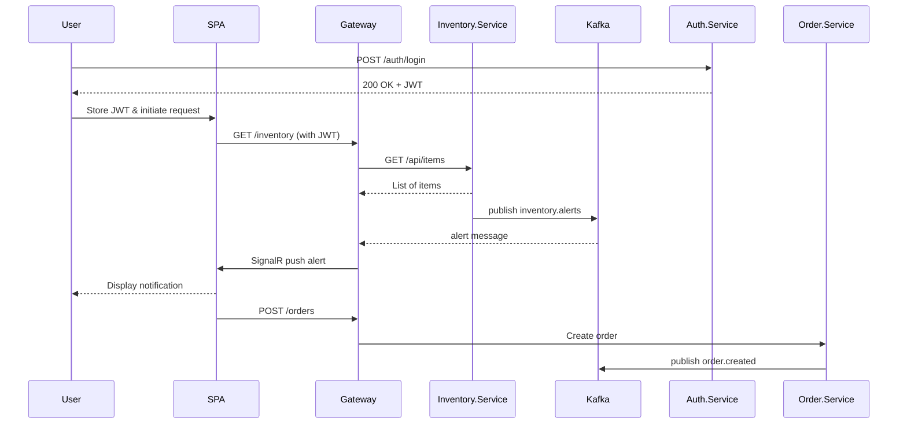

**Project Requirements Document (PRD): Angular ERP Inventory Module**

---

## 1. Technology Versions & Best Practices

- **.NET 9 STS** (latest short-term support)
- **Angular 20** (latest stable release)
- **Angular Material** (latest component library & styling/animations)
- **Apache Kafka 4.0** (latest major release)

**Best Practices**

- Domain‑Driven Design & Bounded Contexts
- Database‑per‑Service (Oracle 19c, PostgreSQL)
- Asynchronous Messaging via Kafka
- API Gateway Pattern (Ocelot/YARP)
- Observability & Health Checks (OpenTelemetry, Prometheus, Serilog)

---

## 2. High-Level Architecture

```plaintext
+----------------------------------+          +----------------+
| erp-inventory-angular (Angular)  | REST/API | Gateway.API    |
| + Angular Material UI            | <------> | (Ocelot/YARP)  |
+----------------------------------+          +--------+-------+
                                                     |
                                                     v
    +------------------+   +----------------+   +------------------+
    | Inventory.Service|   | Order.Service  |   | Supplier.Service |
    | (Oracle 19c)     |   | (PostgreSQL)   |   | (Oracle 19c)     |
    +--------+---------+   +------+---------+   +---------+--------+
             |                      |                    |
             | Kafka <alerts>      | Kafka <order.created>
             v                      v                    v
        +------------+         +-----------+        +-------------+
        | Kafka      |         | Auth.Service|      | (shared)    |
        | Broker     |         | (JWT Identity)     |             |
        +------------+         +-----------+        +-------------+
```

---

## 3. Service Breakdown & Responsibilities

Each microservice exposes clear REST endpoints, adheres to single responsibility, and publishes or consumes Kafka topics as needed.

- **Auth.Service**

  - Responsibilities: user registration, login, token issuance, password reset
  - Endpoints:

    - `POST /api/auth/register` (register new user)
    - `POST /api/auth/login` (returns JWT)
    - `POST /api/auth/refresh` (refresh JWT)
    - `POST /api/auth/reset-password`

  - Database: PostgreSQL for identity store
  - Publishes: none
  - Consumes: none

- **Inventory.Service**

  - Responsibilities: manage inventory items, track stock levels
  - Endpoints:

    - `GET /api/inventory/items` (list items with pagination, filtering by name, supplier)
    - `GET /api/inventory/items/{id}` (retrieve item details)
    - `POST /api/inventory/items` (create new item)
    - `PUT /api/inventory/items/{id}` (update item)
    - `DELETE /api/inventory/items/{id}` (remove item)

  - Database: Oracle 19c
  - Publishes: `inventory.alerts` (when stock < reorder threshold)
  - Consumes: none

- **Order.Service**

  - Responsibilities: process orders, validate stock availability, calculate totals
  - Endpoints:

    - `GET /api/orders` (list orders; filter by status, date range)
    - `GET /api/orders/{id}` (order details)
    - `POST /api/orders` (create order; reserves stock)
    - `PUT /api/orders/{id}/status` (update order status)

  - Database: PostgreSQL
  - Publishes: `order.created` (on new order), `order.completed`
  - Consumes: `inventory.alerts` (to flag low-stock items in pending orders)

- **Supplier.Service**

  - Responsibilities: manage supplier data, contact details, reordering schedules
  - Endpoints:

    - `GET /api/suppliers` (list suppliers; search by name or region)
    - `GET /api/suppliers/{id}` (supplier profile)
    - `POST /api/suppliers` (add supplier)
    - `PUT /api/suppliers/{id}` (update supplier)
    - `DELETE /api/suppliers/{id}` (deactivate supplier)

  - Database: Oracle 19c
  - Publishes: none
  - Consumes: none

- **Gateway.API**

  - Responsibilities: central routing, JWT validation, rate limiting, CORS handling, load balancing
  - Routes: delegates `/api/auth/*`, `/api/inventory/*`, `/api/orders/*`, `/api/suppliers/*`
  - Integrations:

    - Kafka client for metrics collection
    - SignalR hub for real-time alerts

---

## 4. Angular SPA Features

- Built exclusively with **Angular Material** (layouts, form controls, tables, dialogs, snack bars)
- Authentication with route guards
- Inventory list/detail (MatTable + ReactiveForms) with low‑stock snack bars
- Order wizard (multi‑step form) with real‑time updates
- Supplier management via Material dialogs
- Dashboard summary cards; export to CSV/PDF

---

## 5. Data Flow & Sequence



---

## 6. Local Development & Deployment

- **Docker Compose** spins up Oracle XE, PostgreSQL, Kafka, Auth, Inventory, Order, Supplier, Gateway
- **Run**

  ```bash
  docker-compose up --build
  ng serve
  ```

- See **Appendix A** for port assignments

---

## 7. Database Initialization

- `DbInitializer` seeds:

  - 10 inventory items
  - 3 suppliers
  - 5 orders

---

## 8. Testing Strategy

- **Back-end:** xUnit + Testcontainers (Oracle/PostgreSQL/Kafka)
- **Front-end:** Karma + Jasmine (Angular Material components)

---

## 9. Documentation & Screenshots

- Swagger UI for each microservice
- JPEG/PNG screenshots: inventory list, order wizard, supplier form, dashboard alerts
- Exported architecture diagram image

---

## 10. Non-Functional Requirements

- **Performance:**

  - API 95th‑percentile latency ≤ 200 ms @ 100 RPS
  - Front-end Lighthouse score ≥ 90

- **Scalability:**

  - Support 1,000 concurrent users; growth 100 GB data/year

- **Security:**

  - API Gateway rate‑limiting; OWASP Top 10 mitigations; JWT revocation

- **Accessibility & SEO:**

  - WCAG 2.1 AA; meta tags; schema.org; sitemap

---

## 11. UX/UI Artifacts

- Low‑fi wireframes (mobile/desktop)
- Style guide (colors, typography, spacing tokens)
- User stories & acceptance criteria

---

## 12. CI/CD & Hosting

- **Hosting:**

  - .NET services → Azure App Service/AWS ECS
  - Angular SPA → Netlify/Vercel

- **Pipeline:**

  - GitHub Actions: build/test/lint/publish
  - Terraform/ARM for infra as code

- **Deployment:** blue/green or canary; auto‑rollback

---

## 13. Roadmap & Milestones

| Phase      | Deliverables                          | Timeline |
| ---------- | ------------------------------------- | -------- |
| **MVP**    | Backend & SPA skeleton; Docker setup  | Week 1–2 |
| **Core**   | Auth, inventory, Kafka integration    | Week 3   |
| **Polish** | UI refinement, tests, CI/CD pipeline  | Week 4   |
| **Launch** | Production deploy; monitoring enabled | Week 5   |

**Success Metrics:** ≥ 5 form submissions/month; avg. session ≥ 2 min; bounce ≤ 50%

---

## 14. Monitoring & Alerts

- **SLOs/SLIs:**

  - 99.9% uptime; error rate < 0.1%

- **Alerts:** CPU/memory > 80%; pipeline failures; error‑rate spikes (> 5% in 5 min)

---

## 15. Error Handling & Fallback Mechanisms

To ensure resilience and graceful degradation, each service will implement the following patterns:

1. **Retry Policies**

   - Exponential-backoff with jitter on all outbound HTTP and Kafka calls (max 3 retries).

2. **Circuit Breakers**

   - Use Polly in .NET services to wrap downstream calls (DB, Kafka, HTTP).
   - Open circuit after 5 failures in 30 seconds; reset after a 1-minute cool-down.

3. **Dead-Letter Queues (DLQs)**

   - Define a companion `<topic>.DLQ` for each Kafka topic.
   - After retry exhaustion, failed messages route to DLQs for manual inspection.

4. **Bulkhead Isolation**

   - Allocate separate thread-pools or connection pools per external dependency to contain faults.

5. **Fallback Responses & Compensations**

   - **Inventory.Service Unavailable**

     - During order creation, if stock lookup fails:

       - **Optimistic Approval:** mark order status as `PendingConfirmation`, enqueue `inventory.verify` message for reconciliation.
       - SPA notifies user: “Order received; final stock confirmation pending.”

   - **Database Timeout**

     - Return cached last-known stock levels with a warning flag in API response.

   - **Kafka Broker Unreachable**

     - Buffer messages in-memory; if full, persist to disk for later backfill.

   - **Order Approval but Inventory Down**

     - Approve order, set status to `PendingInventoryCheck`, and trigger compensating workflow:

       - Retry inventory reservation asynchronously.
       - If stock still unavailable, auto-cancel order and notify user via email/UI banner.

6. **Graceful Degradation in the SPA**

   - Service health-check polling; if Inventory down:

     - Disable “Create Order” button with tooltip “Ordering paused; please try again soon.”
     - Fall back SignalR to 30s polling for alerts.

7. **Alerting & Escalation**

   - HealthChecks emit metrics when retry thresholds or circuit-breaker events occur.
   - DLQ activity triggers Ops notifications (Slack/Webhook).

8. **Observability & Telemetry**

   - Trace retries, circuit-breaker transitions, and fallback paths in OpenTelemetry spans.
   - Dashboards to monitor:

     - % of orders in `PendingConfirmation`/`PendingInventoryCheck`.
     - DLQ message counts per topic.
     - Circuit-breaker state over time.

---

## 15. Roles & Permissions

- **RBAC Model**
  - Roles: Admin, Manager, Clerk
  - JWT claims/scopes map to operations

- **Enforcement**
  - .NET: `[Authorize(Roles="…")]`
  - Angular: route guards & UI feature flags

---

## 16. API Versioning & Contract Testing

- **Versioning:** URL-based (`/v1/inventory`, `/v2/orders`) with backward compatibility
- **Contract Tests:** Pact for consumer-driven contracts, automated in CI

---

## 17. Contract & Load Testing

- **Kafka Schema Contracts:** enforce via Schema Registry (Avro/JSON)
- **Load/Stress Tests:** k6 or Gatling simulating peak loads (500 orders/min, 1000 RPS)
- **SLAs:** 95th-pct API latency ≤ 200 ms under test load

## Appendix A: Local Setup

- **Ports:** Oracle XE: 1521; PostgreSQL: 5432; Kafka: 9092; Services: 5006–5010
